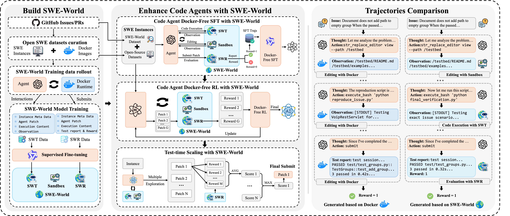
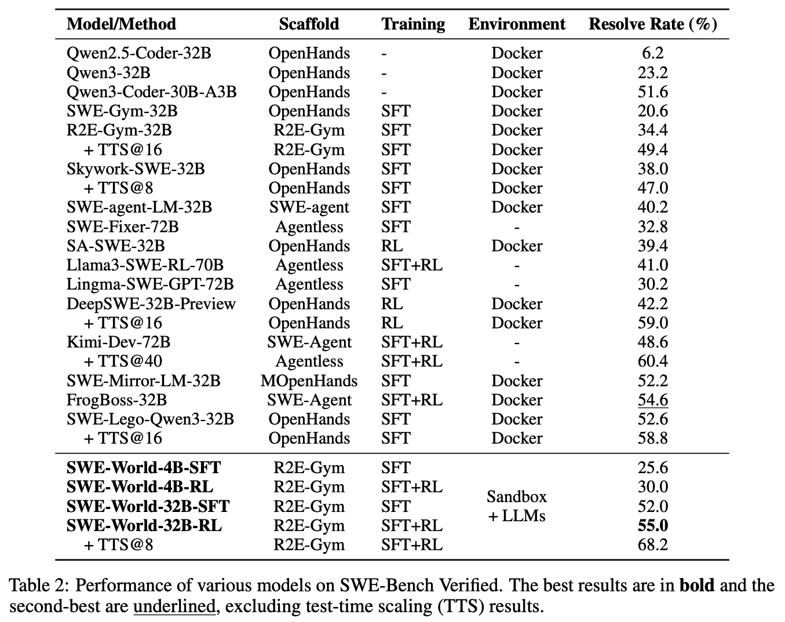
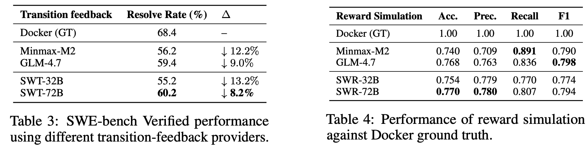
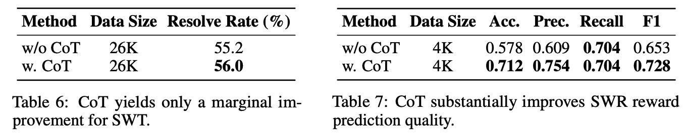
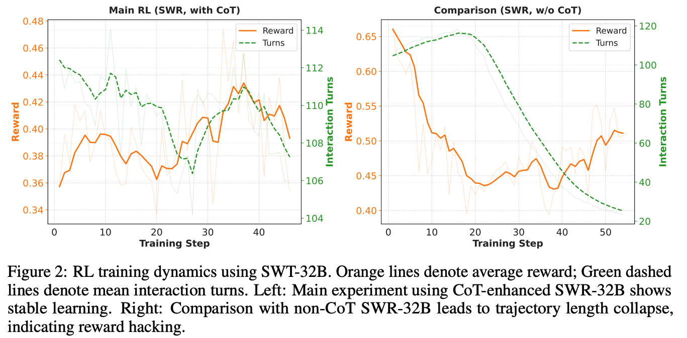
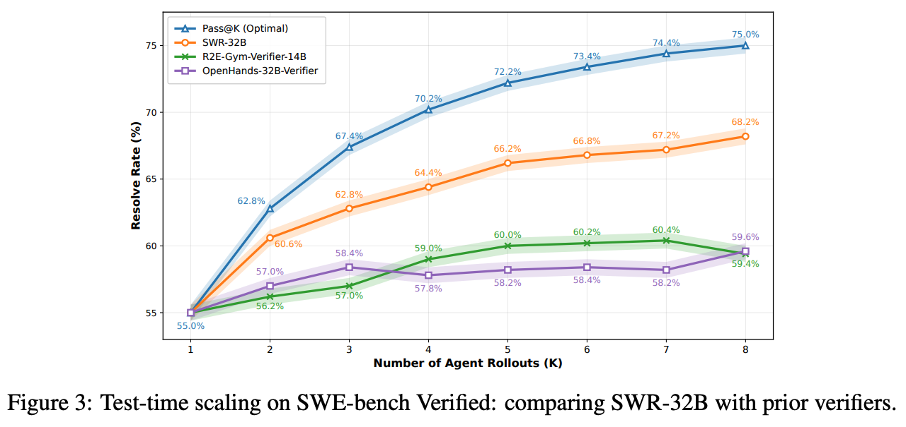
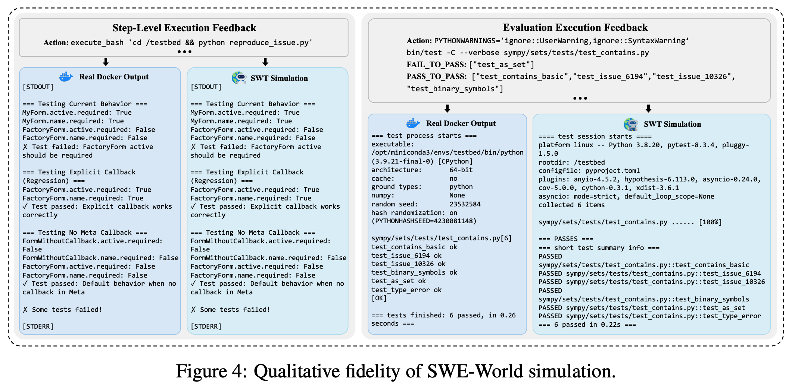

<h1 align="center">SWE-World: Building Software Engineering Agents in Docker-Free Environments</h1>

<div align="center">
  <a href="LICENSE"></a>
  <a href="LICENSE"></a>
  <!-- TODO: replace with your paper link -->
  <a href="https://arxiv.org/pdf/2602.03419" target="_blank"></a>
  <!-- TODO: replace with your HF collection/model link if any -->
  <a href="https://huggingface.co/collections/RUC-AIBOX/swe-agent-series" target="_blank"></a>
</div>

<h5 align="center">If you like our project, please give us a star ⭐ on GitHub for the latest update.</h5>

---

## ✨ News
+ [4 Feb 2026] ⚡️⚡️ [**SWE-World**](https://arxiv.org/pdf/2602.03419): We introduce SWE-World, a fully Docker-free framework that replaces physical execution environments with learned surrogates. It lifts Qwen2.5-Coder-32B from 6.2% to 55.0% on SWE-bench Verified via fully Docker-free agentic SFT and RL, and further attains 68.2% through test-time scaling (TTS@8).

+ [4 Feb 2026] ⚡️⚡️ [**SWE-Master**](https://arxiv.org/pdf/2602.03411): We introduce SWE-Master, a fully reproducible post-training framework for Qwen2.5-Coder-32B that integrates agentic SFT and RL to achieve 61.4% (Pass@1) and 70.8% (TTS@8) resolve rates on SWE-bench Verified. Meanwhile, the framework incorporates IDE-level capabilities during inference via LSP-driven tool.

## Model Releases

We release the SWE-World models on Hugging Face. The **SWE-World Transition Model (SWT)** and **SWE-World Reward Model (SWR)** are available at:

- SWT: https://huggingface.co/RUC-AIBOX/SWE-World-SWT-32B-wo-cot  
- SWR: https://huggingface.co/RUC-AIBOX/SWE-World-SWR-32B-w-cot  

These models simulate step-level execution feedback (SWT) and final test rewards (SWR), enabling fully Docker-free training and evaluation of SWE agents in SWE-World.

---


## 💡 Overview
SWE agents typically rely on containerized execution environments (e.g., Docker) to obtain step-level execution feedback and final unit-test results. While effective, Docker-based pipelines are expensive and brittle at scale. **SWE-World** replaces physical execution with a *learned surrogate world*: a sandbox lightweight handles file-system edits, an LLM-based **Transition Model (SWT)** simulates step-level execution feedback for commands that would otherwise require Docker, and an LLM-based **Reward Model (SWR)** acts as a virtual test runner that produces structured test feedback and a binary success signal. This enables **fully Docker-free** data generation, supervised fine-tuning (SFT), reinforcement learning (RL), and test-time scaling (TTS) for repository-level issue resolution.

<p align="center">
  
</p>

---

## ✨ Key Insights
- Docker-Free SWE Environment: We propose SWE-World, a Docker-free framework that replaces physical execution environments with a learned surrogate for training and evaluating software engineering agents.

- Effective Agent Training without Execution: We show that LLM-based environment feedback can successfully support SFT and RL, achieving performance comparable to or better than training with real execution.

- Scalable Use of Open-Source SWE Data: By eliminating the requirement for buildable environments, SWE-World enables substantially broader utilization of real-world GitHub data for training software engineering agents. 

---

## ✨ Method
SWE-World has two parts: **(1) Build SWE-World** (train world models), and **(2) Train SWE Agents with SWE-World** (use SWE-World to generate trajectories and optimize agents).

### 1) Build SWE-World
- **Sandbox**: executes Navigation & Editing actions (e.g., `ls`, `cat`, `grep`, `str_replace`).
- **SWT (SWE-World Transition Model):** predicts step-level execution feedback (e.g., stdout/stderr/exit status) for code execution commands.
- **SWR (SWE-World Reward Model):** replaces containerized unit-test runs at the end of a trajectory; it generates a structured test report and outputs a binary reward.


### 2) Train SWE Agents with SWE-World (Docker-Free SFT & RL)
- **Data Preparation:** we construct a unified instance pool from (i) open-source SWE datasets and (ii) a newly curated **SWE-World Dataset** (16.6K tasks across 3,763 repositories).
- **Docker-Free SFT:** we roll out powerful code agents inside SWE-World to generate trajectories, then apply filtering (rule-based + SWR-based) and perform agentic SFT.
- **Docker-Free RL:** starting from the SFT checkpoint, we run RL where SWT provides step-level feedback and SWR provides rewards.
- **Docker-Free Test-Time Scaling (TTS):** for each issue instance, sample multiple candidate trajectories, use SWR to score them, and submit the best candidate.

---

## 📄 Overall Performance

### Main results on SWE-bench Verified (Resolve Rate %)
Our fully Docker-free pipeline substantially improves strong open-source backbones, and SWR enables effective Docker-free test-time scaling:

<p align="center">
  
</p>

> Notes: Resolve Rate is measured via the official SWE-bench Verified Docker evaluation harness; TTS@8 means selecting the best patch among 8 sampled candidates using SWR.


### Performance of SWT and SWR

- **SWT:** SWT-72B best closes the sim-to-real gap, supporting **60.2%** resolve rate for Minmax M2.1, higher than GLM-4.7 (**59.4%**) and Minmax-M2.1 (**56.2%**).
- **SWR:** SWR-32B is strong and precise (Acc **0.754**, Prec **0.779**). Scaling to SWR-72B further improves (Acc **0.770**, Prec **0.780**), yielding the best comprehensive reward simulation.

<p align="center">
  
</p>

---

## 🔎 Analysis

### 1) Impact of Chain-of-Thought (CoT)
We train and compare the performance of SWT/SWR with and without CoT in their outputs. CoT provides **asymmetric benefits**: it yields only marginal gains for SWT, but **substantially improves** SWR’s reward prediction quality (Accuracy/Precision/Recall/F1), making the reward signal more reliable.

<p align="center">
  
</p>

### 2) RL Training Dynamics (Stability vs. Reward Hacking)
With CoT-enhanced SWR, Docker-free RL learns stably. Without CoT, training can collapse due to reward hacking (short invalid solutions mistakenly rewarded).

<p align="center">
  
</p>

### 3) Test-Time Scaling (TTS)
SWR provides a strong ranking signal: performance increases monotonically with K and reaches 68.2% at TTS@8, outperforming prior verifiers under the same setting.

<p align="center">
  
</p>

### 4) Qualitative Fidelity of Simulation
We provide side-by-side comparisons between real Docker outputs and SWT/SWR simulated outputs for both step-level feedback and final test reports.

<p align="center">
  
</p>

---

## 🏃 Quick Start


### Data Preparation

Before running SWE-World, the datasets and repositories need to be prepared.

```bash
# 1. Download raw SWE datasets
bash data_preparation/download_swe_datasets.sh

# 2. Convert datasets from Parquet to JSON
python data_preparation/merge_parquet_to_json.py

# 3. Clone all required repositories with full commit history
bash data_preparation/crawl_repos.sh

# 4. Add local repository paths to dataset
python data_preparation/add_local_dir.py
```

📌 For the complete data preparation pipeline and optional steps, see
[`data_preparation/README.md`](./data_preparation/README.md).


### Inference & Evaluation

#### Environment Setup 

```bash
# Install uv
curl -LsSf https://astral.sh/uv/install.sh | sh
source $HOME/.local/bin/env

# Activate venv
cd SWE-World/swe_world

uv venv --python 3.10
source .venv/bin/activate
uv pip install "setuptools<70" wheel
uv sync && uv pip install -e .

# Install SWE dataset-related packages for inference
uv pip install new_packages/swebench_fork_swegym-2.0.13-py3-none-any.whl

uv pip install new_packages/swebench_fork_swerebench-4.0.3-py3-none-any.whl

uv pip install new_packages/swesmith-0.0.7-py3-none-any.whl
```


#### Inference

```bash
# run with world models
# 1. launch world models
bash scripts/launch_world_models.sh
# 2. run inference
bash scripts/run_mode_simulated.sh

# run with docker
bash scripts/run_mode_docker.sh

# run for collecting world model training data
bash scripts/run_mode_collect.sh

```

#### Test Time Scaling

We provide a fully Docker-free TTS pipeline based on SWR.

Steps:
- Sample K trajectories (`collect` mode)
- Extract reward contexts
- Simulate rewards with SWR
- Select best candidate and compute Pass@K

📌 Detailed guide:
[`swe_world/src/simulation/tts/README.md`](./swe_world/src/simulation/tts/README.md)

#### Examples and Visualization

A sample trajectory file generated after inference is available at:  
`./data_examples/r2e-gym-inference-traj/glm46_0_used_swe_rebench_1_demo.jsonl`

To facilitate a more intuitive and efficient analysis of the generated trajectories, you can use the following scripts to convert them into HTML format for visualization:

```bash
# Generate visualization
python ./swe_world/src/simulation/app/json_to_html.py [jsonl-file-path] -o [html-file-path]

```

For the demo data provided, the corresponding visualized HTML files are located at: `./data_examples/r2e-gym-inference-traj/glm46_0_used_swe_rebench_1_demo-en.html`


### SFT World Models

This section describes how to prepare supervised fine-tuning (SFT) data for SWE-World **world models**, including:
- **SWT (Transition Model):** simulates step-level execution feedback (stdout/stderr/exit status).
- **SWR (Reward Model):** simulates final unit-test reports and outputs a binary success signal.

We provide scripts to (1) generate per-sample `initial_analysis`, (2) collect SFT datasets for reward/transition models, and (optionally) (3) produce and filter Chain-of-Thought (CoT) reasoning traces.

📌 **Detailed instructions:** see [`swe_world/src/simulation/world_model_sft_data/README.md`](./swe_world/src/simulation/world_model_sft_data/README.md).

### SWE Agent SFT Training

> [!IMPORTANT]
> We utilize [OpenRLHF](https://github.com/OpenRLHF/OpenRLHF) as our framework for Supervised Fine-Tuning (SFT). It is an excellent open-source repository.

> [!IMPORTANT]
> Training was conducted on an internal platform with packages pre-installed in the environment image. The "Environment Setup" provided here aims to replicate our training environment as closely as possible. If you encounter issues, please open an **issue**, and we will investigate and resolve it promptly.


#### Environment Setup 

The packages required for the training environment are listed below and can be downloaded as needed:

```bash
cat ./SFT_ENV.txt
```

You can refer to the environment configuration provided by [OpenRLHF](https://github.com/OpenRLHF/OpenRLHF) for installation. If you are using Ray, ensure that the environment is configured uniformly across all nodes:
```bash
cd ./OpenRLHF_SFT
uv venv --python 3.11
source .venv/bin/activate
git clone https://github.com/OpenRLHF/OpenRLHF.git
cd OpenRLHF
pip install -e .
```

#### Data Processing (Optional)
You can directly process the trajectories generated via inference using the R2E-Gym framework by running the following scripts. This will convert them into an SFT-compatible format and apply necessary filtering:
```bash
python ./OpenRLHF_SFT/SFT_data_pre_process/r2e_to_openrlhf_format/0_covert_r2e_format_to_sft_foramt.py

python ./OpenRLHF_SFT/SFT_data_pre_process/r2e_to_openrlhf_format/1_init_format_filter.py
```

An example of SFT data is provided here for formatting reference: 
`./data_examples/sft_data`

#### Training

```bash
# Pre-tokenize multi-turn interaction trajectories and compute loss masks (Optional, but recommended to avoid training bottlenecks)
# Directly embeds function descriptions into the system prompt
python ./OpenRLHF_SFT/scripts_swe_master/sft_data_pre_tokenize.py 

# Train the model to support tool_calls
python ./OpenRLHF_SFT/scripts_swe_master/sft_data_pre_tokenize_toolcall.py 

# Optional: This step is required if you pre-tokenized the multi-turn data in the previous steps
mv ./OpenRLHF_SFT/scripts_swe_master/sft_dataset.py ./OpenRLHF_SFT/datasets/ 

# Launch training
bash ./OpenRLHF_SFT/scripts_swe_master/qwen_25_coder_32B_new_remove_01_not_dedep.sh
```

### RL Training

> [!IMPORTANT]
> Our development is built upon the open-source frameworks [DeepSWE](https://github.com/agentica-project/rllm) and [rLLM](https://github.com/rllm-org/rllm), both of which are highly recommended repositories.

> [!IMPORTANT]
> Training was conducted on an internal platform with packages pre-installed in the environment image. The "Environment Setup" provided here aims to replicate our training environment as closely as possible. If you encounter issues, please open an **issue**, and we will investigate and resolve it promptly.


#### Environment Setup 

The packages required for the training environment are listed below and can be downloaded as needed:

```bash
cat ./RL_ENV.txt
```

You can refer to the environment configurations provided by [DeepSWE](https://github.com/agentica-project/rllm) and [rLLM](https://github.com/rllm-org/rllm) for installation. If you are using Ray, ensure that the environment is configured uniformly across all nodes:
```bash
cd ./DeepSWE_RL/rllm
uv venv --python 3.11
source .venv/bin/activate
uv pip install -e .
git clone https://github.com/verl-project/verl.git # We use version v0.5
uv pip install -e ./verl
```

Additionally, you must update the local paths for VeRL and R2E-Gym (corresponding to the training and inference frameworks, respectively) in the following file:
- Update the paths corresponding to the two `sys.path.insert` functions within `train_agent` in: `./DeepSWE_RL/rllm/rllm/trainer/verl/train_agent_ppo.py`

Furthermore, to support training across different SWE datasets, you must ensure the relevant dataset libraries are installed when initializing Ray via the `run_ppo_agent` function in `./DeepSWE_RL/rllm/rllm/trainer/verl/train_agent_ppo.py` (Alternatively, these can be pre-installed during the initial environment setup).

#### Data Processing (Optional)
If your training server operates in an offline environment (no internet access), you must [pre-process the unit tests for the specific SWE datasets](#offline-unit-test-generation-optional) and then standardize their formats:
```bash
# Standardize the format
python ./data_preparation/make_test_spec_for_rl.py
```

An example of processed data ready for RL training can be found here for formatting reference: 
`./data_examples/rl_data/ood_data`

#### Training
```bash
bash .DeepSWE_RL/rllm/examples/swe/run_swe_rl.sh
```


---

## 📄 Citation
If you find SWE-World useful, please cite our paper:

```bibtex
@misc{sun2026sweworldbuildingsoftwareengineering,
      title={SWE-World: Building Software Engineering Agents in Docker-Free Environments}, 
      author={Shuang Sun and Huatong Song and Lisheng Huang and Jinhao Jiang and Ran Le and Zhihao Lv and Zongchao Chen and Yiwen Hu and Wenyang Luo and Wayne Xin Zhao and Yang Song and Hongteng Xu and Tao Zhang and Ji-Rong Wen},
      year={2026},
      eprint={2602.03419},
      archivePrefix={arXiv},
      primaryClass={cs.SE},
      url={https://arxiv.org/abs/2602.03419}, 
}
```

# Acknowledgements
- Our work builds upon several outstanding open-source repositories, including [OpenRLHF](https://github.com/OpenRLHF/OpenRLHF), [R2E-Gym](https://github.com/R2E-Gym/R2E-Gym), [VeRL](https://github.com/verl-project/verl), [DeepSWE](https://github.com/agentica-project/rllm) and [rLLM](https://github.com/rllm-org/rllm). We are sincerely grateful to the authors for making their high-quality training code available to the community.
- This work was conducted at the [BOSS Zhipin Nanbeige Lab](https://huggingface.co/Nanbeige). We would like to express our gratitude to the company for providing the necessary computing resources and professional guidance.

## 📄 License

This project is released under the [MIT License](LICENSE).


## 📞 Contact

For any questions or feedback, please reach out to us at [sunshuang@ruc.edu.cn](sunshuang@ruc.edu.cn).